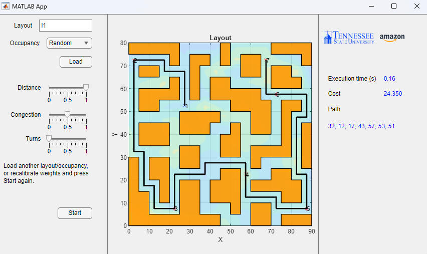

# genetic path planning

This repository contains Matlab code for using Genetic Search with A* search for robotic path planning.

Given an unordered list of stopping points, a cost function, and a floor plan, an optimal list of stops is calculated using genetic search.

This repository provides two endpoints: A GUI application, and a function.



For example use of the functional interface, see [ga_unordered](./ga_unordered.m).

## Usage

```matlab

% Get the problem specification (start, goal points, genetic operators)
prob = getProb();

% Set the local fitness function.
% The local fitness function is the cost of individual paths between two
% stop points. The following is the default implementation:
prob.fitness_local = @(sol) costFunc(sol, prob.adj, prob.start, prob.goal, ...
    prob.coords, prob.occupancy, 0, wdist, wturn, wcong);
% This is the general signature:
prob.fitness_local = @(array containing ordering of stop points) (fitness value, lower is better)

% Set the global fitness function. This is the fitness of the sequence of stopping points.
fitness = @costFuncUnordered;
% The signature is
fitness = @(array of stop points, prob) (fitness value, prob)

% Run the genetic search:
[stops, cost, timeTaken, prob] = GAVariable(prob, fitness);
```